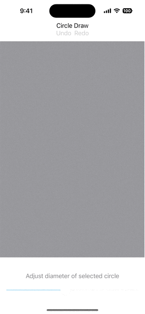

# 7GUIs Tasks

SwiftUI implementation of [The 7 Tasks](https://7guis.github.io/7guis/tasks)

## Tasks

1. Counter

> Challenge: Understanding the basic ideas of a language/toolkit.

> 

2. Temperature Converter

> Challenges: bidirectional data flow, user-provided text input.

> 

3. Flight Booker

> Challenge: Constraints.

> 

4. Timer

> Challenges: concurrency, competing user/signal interactions, responsiveness.

> 

5. CRUD

> Challenges: separating the domain and presentation logic, managing mutation, building a non-trivial layout.

> 

6. Circle Drawer

> Challenges: undo/redo, custom drawing, dialog control*.

> 

7. Cells

> Challenges: change propagation, widget customization, implementing a more authentic/involved GUI application.

> 

Caveat Emptor. This repository is educational (learning SwiftUI) and does not demonstrate SwiftUI best practices.

## Author

[Rex Feng](https://rexfeng.com) 2022 - 2023
